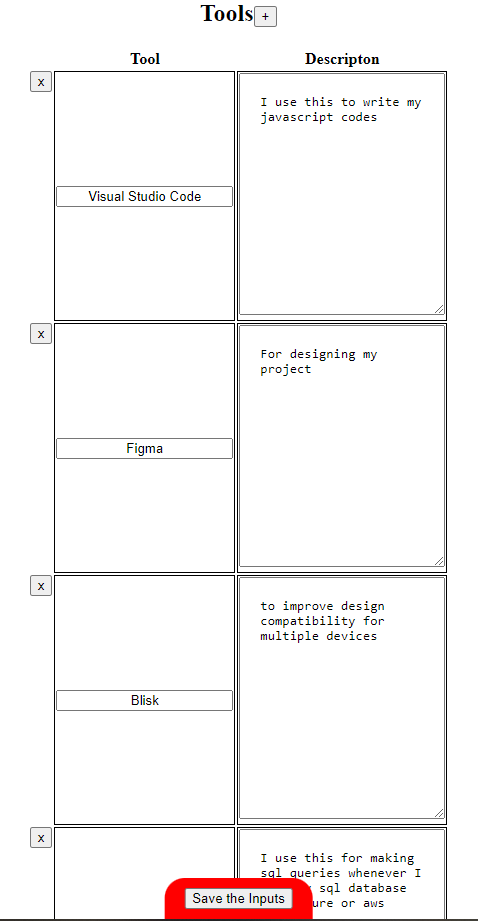

# Portfolio Manager
Hello everyone welcome to my portfolio manager. Here I will explain how this ui works if i want to update my portfolio website

# About Me Section


this section shows the password input, my display photo, and the inputs of my role and a detail about me.

At the bottom of the viewport you will see a button "save the inputs". So whenever I clicked this button all the string inputs will be saved to the server

# Project Section


This shows the inputs of <strong>Project Name, Description, Tech Used and github url</strong> of each projects and I can also change image of the project by clicking choose file

# Deleting a Project
If I wanna delete a particular project I'm just gonna click the x button

# Adding a Project
by clicking the plus symbol, it will direct me in this modal 


# Technical Skills Section


This section shows the list of my technical skills and the inputs where I can alter the details. By clicking the plus symbol, this modal will open to add new technical skills


and I'll be able to delete a particular skill by clicking the x button

# Soft Skills

This shows the list of my soft skills and I'm able to edit a partical input if ever I mispelled something or replace a new one.

By clicking the plus symbol it will show this modal to add a new skill


as you noticed, the input got a placeholder saying "write "," to add newline" this means that I can add another skill by puting "," next from the other like this

the result is


When you pay attention the sequence of input does'nt match based from the modal because I used unshift() method from the server instead of push()
```javascript
server.post(SOFT_SKILL_ROUTE,checkPasswordMiddleWare,async (req, res) => {
  const { soft_skills } = req.body
  const readData = await fs.readFile(path.join(__dirname, 'data', 'data.json'))
  const parseReadData = JSON.parse(readData)
  const split = soft_skills.split(',')
  for (let x = 0; x < split.length; x++) {
    //this should be 
    //parseReadData.skills[0].soft_skills.push(split[x])
    parseReadData.skills[0].soft_skills.unshift(split[x])
  }
  const result = JSON.stringify(parseReadData,null,2)
  await fs.writeFile(path.join(__dirname,'data','data.json'),result)
  res.json({message:"Soft skill added successfully"})
})
```

# Tools Section



This shows the table of inputs where I can edit a particular tool and description. By clicking the plus button it will show this modal to add another tool that I learn


For deleting certain tool just click the x button and thats it

